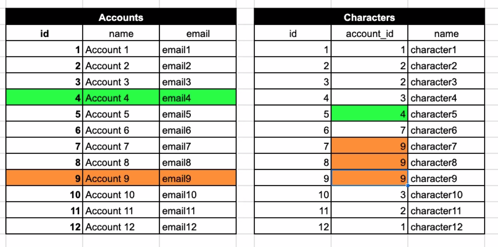
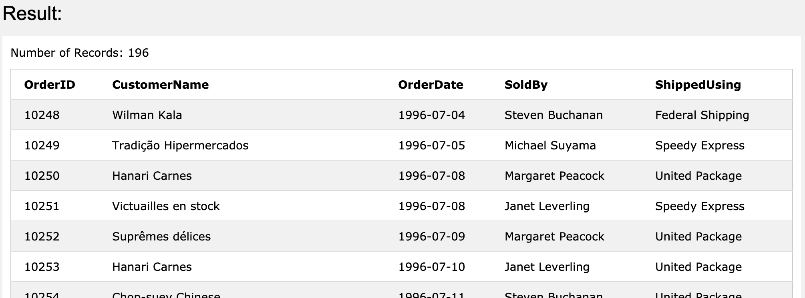
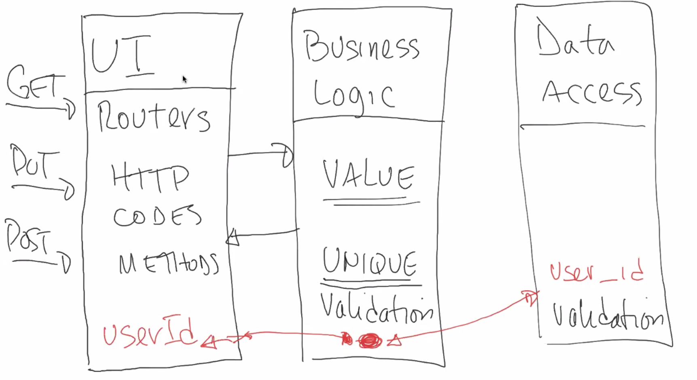

# Multi-Table Queries

- Today's [Training Kit](https://learn.lambdaschool.com/web4node/module/recw2ezN22yjehidj/)
- Recorded Lecture on YouTube

---

## Joining Tables

- What is a Foreign Key:question:

  - `Foreign Key`: pointer to the primary key of another table
  - the value on a column that refers to the primary key (row) on another table

  

- lets practice using [w3school's tool](https://www.w3schools.com/Sql/trysql.asp?filename=trysql_select_all)

  ```SQL
  select o.orderId, c.customerName, o.orderDate, (e.firstName || ' ' || e.lastName) as SoldBy, s.shipperName as ShippedUsing
  from orders as o
  join customers as c on o.customerId = c.customerId
  join employees as e on o.employeeId = e.employeeId
  join shippers as s on o.shipperId = s.shipperId
  ```

  - notice we can rename things that we are querying in the results :eyes:
    - i.e CustomerName & ShippedUsing

  

  - you can insert new values :arrow_down:

  ```SQL
  insert into categories (categoryName, description) values ('Swag', 'Really cool swag');
  ```

  ```SQL
  -- list of products, including category name, organized by the category id ... descending
  select *
  from products as p
  inner join categories as c
  on p.categoryId = c.category.Id

  ```

  - inner join will exclude things where it doesn't find values in both tables
    - regular `join` :left_right_arrow: `inner join`
  - get all categories even if there are no products :arrow_down:

  ```SQL
  -- list of categories, even if there are no products on that category
  select *
  from categories as c
  left join products as p on c.categoryId = p.categoryId
  order by c.categoryId desc
  ```

  - In our database:

  ```SQL
  -- list all accounts and get characters if they are there
  SELECT a.id, a.name, a.email, c.id, c.name
  From accounts as a
  LEFT JOIN characters as c
  ON a.id = c.account_id;
  ```

---

### Joining in JavaScript

[ after first break in 55 ish min in to YT ]

- Example:
  - user (id, username)
  - post (id, contents, user_id)
  - list all posts including the user name
- how would we do this in SQL :question:

  ```SQL
  select p.* from u.username
  from Posts as p
  join Users as u
  on p.user_id = u.id
  ```

- now let do this in [server.js](api/server.js)
- don't forget to import db at the top :exclamation::exclamation:

---

### Organizing an API



- Luis typically does validation and other business logic in _pure_ javascript
  - this way, it doesn't rely on a framework and you won't have to change anything if you ever switch things up

---

### Setting up our User Model

- naming of user-model.js differs company-to-company
- take a look at [user-model.js](users/user-model.js)
- basically, we are removing any business logic from [user-router.js](users/user-router.js) and moving it into our user model
  - notice :eyes: we are using named functions instead of fat arrow
    - allows us have exports at the top (above the fold) and makes things easier to read
    - if we wanted to use fat arrows, we would have to export at the bottom because fat arrows aren't hoisted and need to be declared before they are read

---
